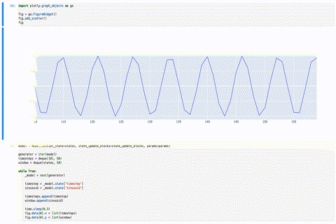
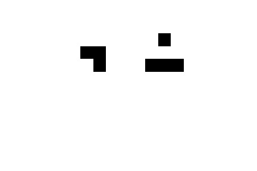

# Examples [accessible -- no dynamic graphics]

---

## Table of Contents

---

 - [Illustratory Models](#illustratory-models)
 - [Open-source Models Using radCAD](#open-source-models-using-radcad)

---

## Illustratory Models

### Iterable Models

Using Models as live in-the-loop digital twins, creating your own model pipelines, and streaming simulation results to update a visualization. That's what an iterable Model class enables.

Check here for a [Jupyter  Notebook with an example](https://github.com/CADLabs/radCAD/blob/master/examples/iterable_models/iterable-models.ipynb):

[//]: # ()

Note: the original version of the above graphic was dynamic, you can find it [here](images/iterable-models.gif).

### [Game of Life](https://www.conwaylife.com/)

[Live radCAD demo model on Streamlit](https://share.streamlit.io/benschza/radcad/examples/streamlit/game_of_life/app.py)

A simple game where at each timestep, the following transitions occur:

1. Any live cell with fewer than two live neighbours dies, as if by underpopulation.
2. Any live cell with two or three live neighbours lives on to the next generation.
3. Any live cell with more than three live neighbours dies, as if by overpopulation.
4. Any dead cell with exactly three live neighbours becomes a live cell, as if by reproduction.

See [examples/game_of_life/game-of-life.ipynb](https://github.com/CADLabs/radCAD/blob/master/examples/game_of_life/game-of-life.ipynb)

Note: the original version of the above graphic was dynamic, you can find it [here](images/game-of-life.gif).

[//]: # (See [examples/game_of_life/game-of-life.ipynb](examples/game-of-life/game-of-life.ipynb))
[//]: # ()

### [Predator-Prey](https://en.wikipedia.org/wiki/Lotka%E2%80%93Volterra_equations)

A simple model that applies the two Lotka-Volterra differential equations, frequently used to describe the dynamics of biological systems in which two species interact:

Original models thanks to [Danilo @danlessa](https://github.com/danlessa/)!

[//]: # (* System dynamics model: [examples/predator_prey_sd/predator-prey-sd.ipynb](examples/predator_prey_sd/predator-prey-sd.ipynb))
[//]: # (* Agent based model: [examples/predator_prey_abm/predator-prey-abm.ipynb](examples/predator_prey_abm/predator-prey-abm.ipynb))

* System dynamics model: [examples/predator_prey_sd/predator-prey-sd.ipynb](https://github.com/CADLabs/radCAD/blob/dev/examples/predator_prey_sd/predator-prey-sd.ipynb)
* Agent based model: [examples/predator_prey_abm/predator-prey-abm.ipynb](https://github.com/CADLabs/radCAD/blob/dev/examples/predator_prey_abm/predator-prey-abm.ipynb)

For additional educational material about the Predator-Prey model, we recommend the cadCAD courses:

[cadCAD Complete Foundations Bootcamp](https://www.cadcad.education/course/bootcamp), which in Sections 5 and 6 introduces a model for an animal population interacting with the environment. The approach is carefully broken down into **system requirements** (including visual system mapping and mathematical specification), **system design** and **system validation**.

[cadCAD Hacks - Season 1](https://www.cadcad.education/course/cadcad-hacks), which in Hack 2 provides a step-by-step introduction to the the Predator-Prey model with cadCAD.

## Open-source Models Using radCAD

* **[Ethereum Economic Model](https://github.com/CADLabs/ethereum-economic-model)** by CADLabs: A modular dynamical-systems model of Ethereum's validator economics
* **[Beacon Runner](https://github.com/ethereum/beaconrunner)** by Ethereum RIG: An agent-based model of Ethereum's Proof-of-Stake consensus layer
* **[GEB Controller Simulations](https://github.com/reflexer-labs/geb-simulations)** by Reflexer Protocol: A Proportional-Integral-Derivative (PID) controller based upon a reference document approach for the Maker DAI market that was never implemented